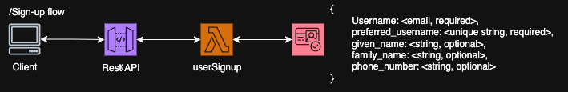

# auth-component

This component is focused around using aws Cognito to authorize users visiting the site.

/Sign-up
This endpoint will be using Cognito to sign users up to site, it will handle our password authentication as well as Two-factor auth via emails only.

;

/Login

/Logout
